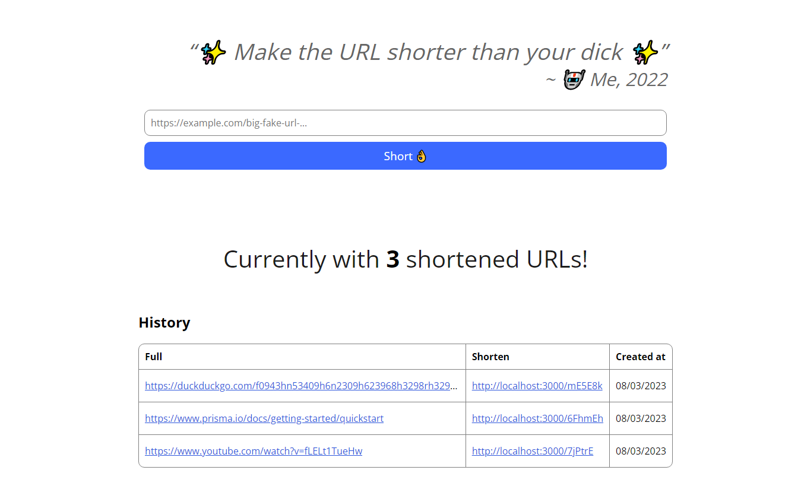

# URL Shortener
An **URL Shortener** using **Express** and **Prisma**.

I created this project to test some technologies. Feel free to use it.

## Setup
1. Clone.
2. `npm install`
3. Clone `.env.example`, rename to `.env` and fill in the fields.
4. [`npx prisma migrate dev`](https://www.prisma.io/docs/reference/api-reference/command-reference#migrate-dev) (for dev environment) or [`npx prisma migrate deploy`](https://www.prisma.io/docs/reference/api-reference/command-reference#migrate-deploy) to generate database file and Prisma artifacts.
5. `npm run dev` (for dev environment) or `npm run build` and `npm start` to start the server.
6. profit 📈.

## Preview
